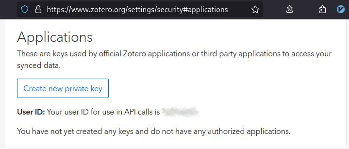
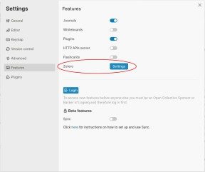
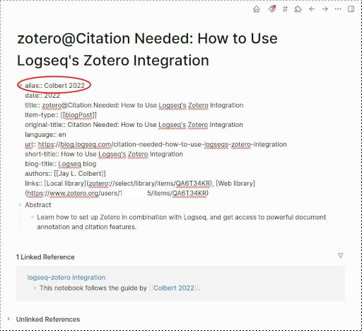

alias:: zotero
tags:: references, literature, zotero

- This notebook follows the guide by [[Colbert 2022]].
- ## Introduction
- On this page, you will find the basic setup to integrate zotero in your logseq workflow.
	- **logseq** is a software designed for knowledge management; it can be used for collecting information about a topic you work on.
	- **zotero** is a reference manager: it is designed for facilitating the management of a digital library, with useful features for literature aggregation, organization, and reference list export.
	- The goal is to connect a zotero collection to logseq, being able to reference zotero entries on logseq pages.
- ## Zotero Prerequisites
- Integration will require a zotero account.
	- Unless you already have one, go to [https://www.zotero.org] and create an account.
	- You will need an *API key*, a cryptographic identifier which will enable logseq to sync with your zotero account. You find that under `zotero.org > [profile] > Settings > Security > Applications`.
	  
	- There, **create a new private key** and store it on your computer.
		- The key should grant read-write access.
		- After creation, a key string will be displayed. **Copy it to a safe place, e.g. a password manager.**
		- Do not share this key with anyone: it grants full power over your zotero library.
	- You should have zotero installed and set up to your liking (conform with INBO standards).
		- TODO could someone please fill in the typical INBO zotero setup? Thank you!
			- betterbibtex
			- link to group library
- ## Logseq Connection
- Next, provide the login key to logseq so that it can sync with your library. This is found in `logseq > Settings > Features > Zotero`
  
- **Do Not** press the **Add all zotero items**; logseq would create pages for each of the references you have in your library. Even without adding, you can search and include individual references.
  
- **Important:** on a shared repository like these guidelines, you do not want to include your personal library files!
	- Give the included pages the prefix `zotero@`.
	- Those pages will be excluded via the `.gitignore` file of the guidelines git repository. You can still cite them.
	- (This is just an extra safety measure to avoid involuntary reference spamming.)
	- Note that your zotero connection information is stored in the `./logseq/config.edn` file of the repository (which should be `.gitignore`d as well).
- ## Usage
- You can import references from zotero by typing `/Zotero` in logseq.
- Then, a search field will pop up, and you can browse your library.
  
- ## Suggestions for Good Practices
	- Use references from the INBO group library.
	- Add the bibtex citation key as an `alias::` for the reference site.
	  
	- You can add certain pages by explicitly overriding the `.gitignore` with `git add -f`. Use that with caution; please do not spam this repo with unnecessary references.
	  ```
	   git add -f "pages/zotero@Citation Needed%3A How to Use Logseq's Zotero Integration.md"
	  ```
	- If you are really sure the reference must be contained within this repository, you may remove the unaesthetic `zotero@` prefix from the page title.